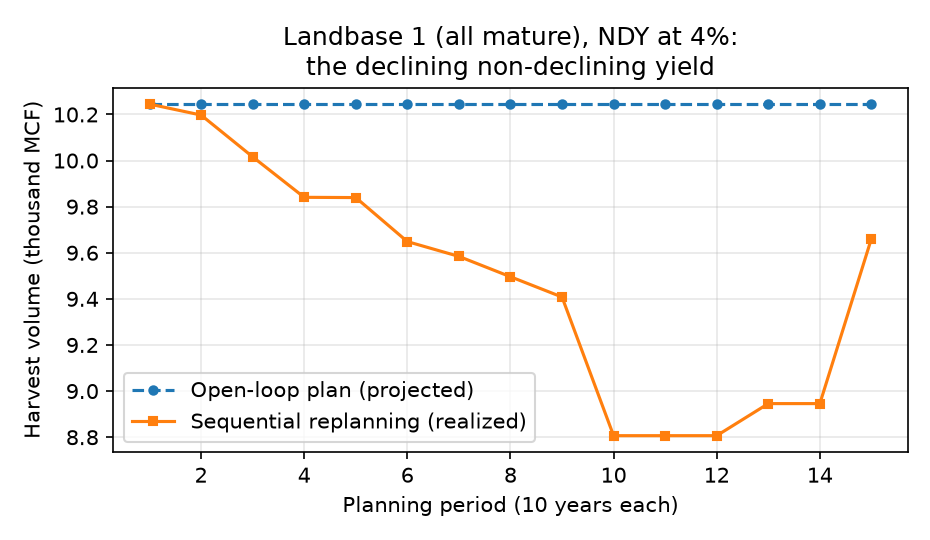

# 02 — Core experiment grid (thesis reproduction)

432 cells: 18 landbases x 4 constant discount rates (0/2/4/6%) x 6
harvest-flow policies (Table 5.6: NHF, NDY, -10%, -20%, +/-10%, +/-20%),
each a full sequential-replanning simulation over the 15-period horizon.
Per-cell records: [grid.csv](../results/experiments/grid.csv) and
[grid_trajectories.csv](../results/experiments/grid_trajectories.csv).

## Headline

- Flow-constrained cells: **73%** exhibit dynamic
  inconsistency (mean relative divergence > 5%).
- No-harvest-flow (NHF) control: **38%** — and that
  divergence is concentrated at 0-2% where the flat objective admits
  alternate optima (see [03](03-gap-diagnostic.md)).

## The declining non-declining yield

## Occurrence and magnitude by harvest-flow policy

| flow_policy | occurrence | mean_abs_rel_deviation |
| --- | --- | --- |
| +/-10% | 0.708 | 0.112 |
| +/-20% | 0.792 | 0.13 |
| -10% | 0.708 | 0.12 |
| -20% | 0.583 | 0.128 |
| NDY | 0.861 | 0.097 |
| NHF | 0.375 | 0.132 |

Flow-constrained policies only:

| flow_policy | occurrence | mean_abs_rel_deviation |
| --- | --- | --- |
| +/-10% | 0.708 | 0.112 |
| +/-20% | 0.792 | 0.13 |
| -10% | 0.708 | 0.12 |
| -20% | 0.583 | 0.128 |
| NDY | 0.861 | 0.097 |

## Occurrence and magnitude by discount rate

| discount_rate | occurrence | mean_abs_rel_deviation |
| --- | --- | --- |
| 0.0 | 1.0 | 0.262 |
| 0.02 | 0.472 | 0.061 |
| 0.04 | 0.5 | 0.064 |
| 0.06 | 0.713 | 0.091 |
