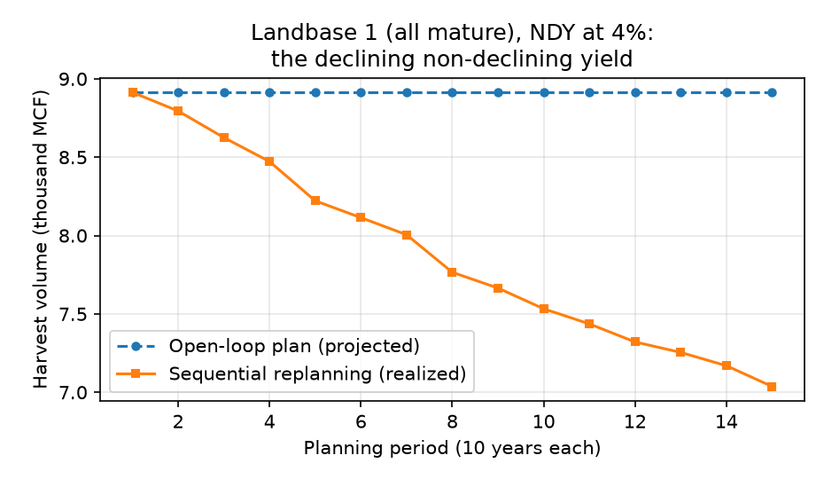

# 02 — Core experiment grid (thesis reproduction)

432 cells: 18 landbases x 4 constant discount rates (0/2/4/6%) x 6
harvest-flow policies (Table 5.6: NHF, NDY, -10%, -20%, +/-10%, +/-20%),
each a full sequential-replanning simulation over the 15-period horizon.
Per-cell records: [grid.csv](../results/experiments/grid.csv) and
[grid_trajectories.csv](../results/experiments/grid_trajectories.csv).

## Headline

- Flow-constrained cells: **56%** exhibit dynamic
  inconsistency (mean relative divergence > 5%).
- Flow-unconstrained (NHF) control: **47%**; by
  discount rate 0%: 18/18, 2%: 16/18, 4%: 0/18, 6%: 0/18. Under a fixed horizon the control's
  divergence falls to 0/72 (a rolling-horizon effect; see
  [03](03-gap-diagnostic.md) and [10](10-review-analyses.md)).

## The declining non-declining yield

## Occurrence and magnitude by harvest-flow policy

| flow_policy | occurrence | mean_abs_rel_deviation |
| --- | --- | --- |
| +/-10% | 0.514 | 0.079 |
| +/-20% | 0.639 | 0.1 |
| -10% | 0.375 | 0.076 |
| -20% | 0.431 | 0.098 |
| NDY | 0.861 | 0.087 |
| NHF | 0.472 | 0.171 |

Flow-constrained policies only:

| flow_policy | occurrence | mean_abs_rel_deviation |
| --- | --- | --- |
| +/-10% | 0.514 | 0.079 |
| +/-20% | 0.639 | 0.1 |
| -10% | 0.375 | 0.076 |
| -20% | 0.431 | 0.098 |
| NDY | 0.861 | 0.087 |

## Occurrence and magnitude by discount rate

| discount_rate | occurrence | mean_abs_rel_deviation |
| --- | --- | --- |
| 0.0 | 1.0 | 0.246 |
| 0.02 | 0.546 | 0.073 |
| 0.04 | 0.296 | 0.04 |
| 0.06 | 0.352 | 0.048 |
