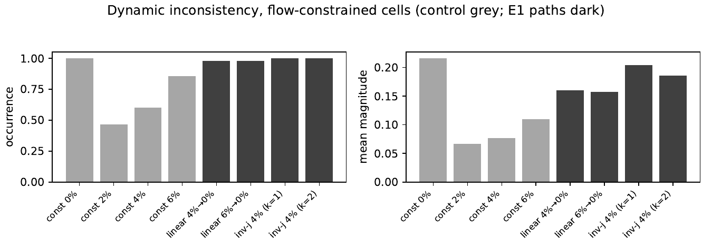
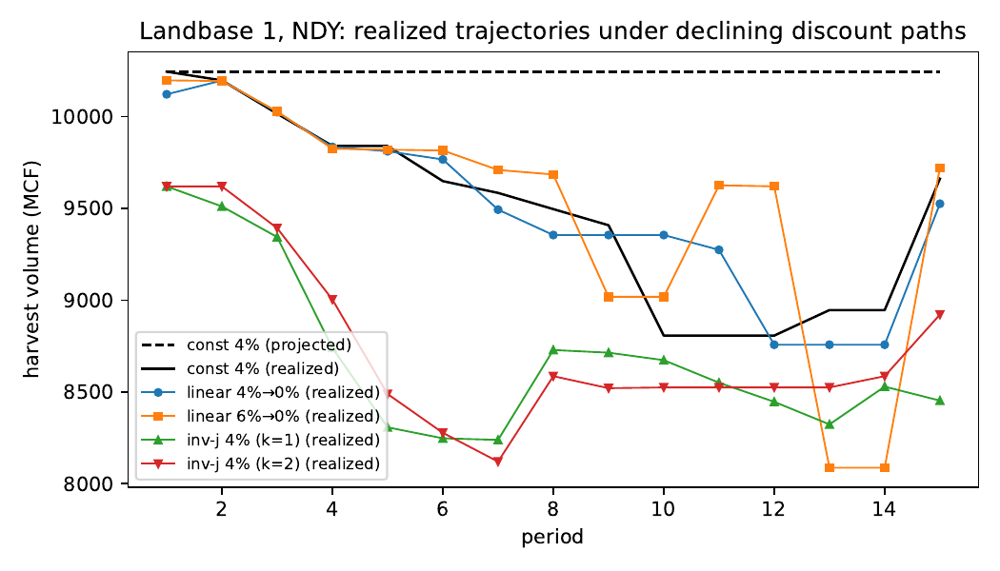

# 05 — E1: Time-varying discount-rate shapes

Does a *declining* discount rate mitigate or eliminate dynamic
inconsistency? Paths: linear 4%->0%, linear 6%->0%, inverse-j 4% (hold 1 or
2 periods, then halve per period). Grid: 432 cells (4 paths x 18 landbases x
6 policies), each with the gap diagnostic. Records:
[summary](../results/experiments/grid_discount_paths.csv) /
[trajectories](../results/experiments/grid_discount_paths_trajectories.csv) /
[gaps](../results/experiments/grid_discount_paths_gaps.csv).
Analysis writeup: [p9 writeup](../results/analysis/p9_discount_shapes/writeup.md).

## Headline

Declining rates make inconsistency MORE pervasive, not less: flow-constrained
occurrence is 99% across the E1 paths, with mean
magnitude 0.18 (vs 0.07-0.11 at constant
2-6%). The no-flow control cells under declining paths diverge at
100% occurrence with genuinely suboptimal/infeasible
tails — a preference-level (Strotz) inconsistency channel, separated from the
structural one in the writeup.

## Occurrence and magnitude by path (flow-constrained cells)

| discount_path | occurrence | mean_abs_rel_deviation |
| --- | --- | --- |
| invj-4pc-k1 | 1.0 | 0.204 |
| invj-4pc-k2 | 1.0 | 0.186 |
| linear-4pc-0pc | 0.978 | 0.16 |
| linear-6pc-0pc | 0.978 | 0.157 |
