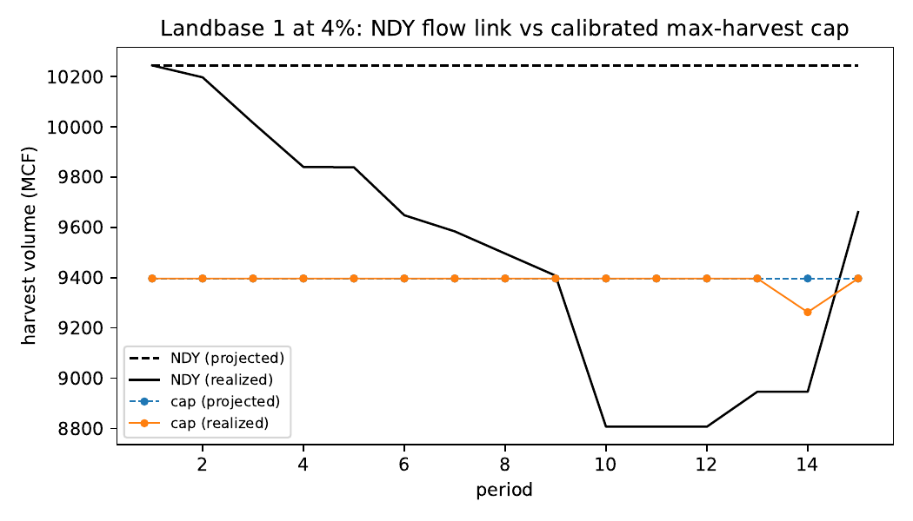

# 06 — E2: Max-harvest-cap even-flow search

If the NDY flow link is replaced by a per-period max-harvest cap calibrated
by bisection until the REALIZED replanned trajectory meets an even-flow
criterion (trend, fluctuation, CV thresholds — `src/fresh_daugherty/evenflow.py`),
is the calibrated plan consistent? Grid: 72 cells (18 landbases x 4 rates).
Records: [summary](../results/experiments/grid_cap_search.csv) /
[trajectories](../results/experiments/grid_cap_search_trajectories.csv) /
[gaps](../results/experiments/grid_cap_search_gaps.csv).
Analysis writeup: [p10 writeup](../results/analysis/p10_cap_search/writeup.md).

## Headline

Cap calibration ELIMINATES dynamic inconsistency: occurrence
0% across the grid (mean divergence
0.004, max
0.025 — all below the 5% tolerance), with
100% convergence. Removing the inter-period link removes the inconsistency.
The calibrated level on landbase 1 (~9,400 MCF/period) is ~8% below the NDY
plan's announced level — an automated allowable-cut calibration pricing the
credibility of the flow promise.

## By discount rate

| discount_rate | occurrence | mean_abs_rel_deviation | calibrated_cap_mcf | converged |
| --- | --- | --- | --- | --- |
| 0.0 | 0.0 | 0.0038 | 8899.4533 | 1.0 |
| 0.02 | 0.0 | 0.0096 | 9135.3402 | 1.0 |
| 0.04 | 0.0 | 0.001 | 9024.0398 | 1.0 |
| 0.06 | 0.0 | 0.0007 | 9030.2152 | 1.0 |
