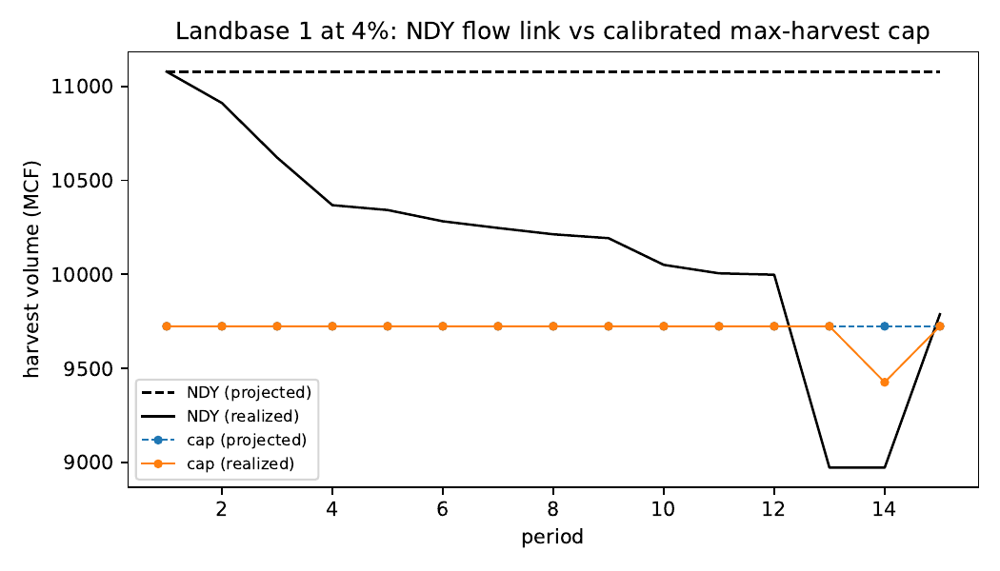

# 06 — E2: Max-harvest-cap even-flow search

If the NDY flow link is replaced by a per-period max-harvest cap calibrated
by bisection until the REALIZED replanned trajectory meets an even-flow
criterion (trend, fluctuation, CV thresholds — `src/fresh_daugherty/evenflow.py`),
is the calibrated plan consistent? Grid: 72 cells (18 landbases x 4 rates).
Records: [summary](../results/experiments/grid_cap_search.csv) /
[trajectories](../results/experiments/grid_cap_search_trajectories.csv) /
[gaps](../results/experiments/grid_cap_search_gaps.csv).
Analysis writeup: [p10 writeup](../results/analysis/p10_cap_search/writeup.md).

## Headline

Under the calibrated caps, occurrence is 3% across the
grid (mean divergence 0.005, max
0.115 — all below the 5% tolerance), with
100% convergence; single periods can still deviate by more than 5% in
7/72 scenarios. The calibrated
level on landbase 1 at 4% (7,950 MCF/period) is 11% below the
NDY plan's *announced* level (8,914). Against what replanned NDY
actually delivers, the cap's total volume differs by
+2.3% and its NPV by
-0.6% (medians over
scenarios; per-scenario spread on page 10).

## By discount rate

| discount_rate | occurrence | mean_abs_rel_deviation | calibrated_cap_mcf | converged |
| --- | --- | --- | --- | --- |
| 0.0 | 0.1111 | 0.0187 | 8842.2277 | 1.0 |
| 0.02 | 0.0 | 0.0012 | 9235.1168 | 1.0 |
| 0.04 | 0.0 | 0.0005 | 8830.3974 | 1.0 |
| 0.06 | 0.0 | 0.0007 | 8791.7611 | 1.0 |
