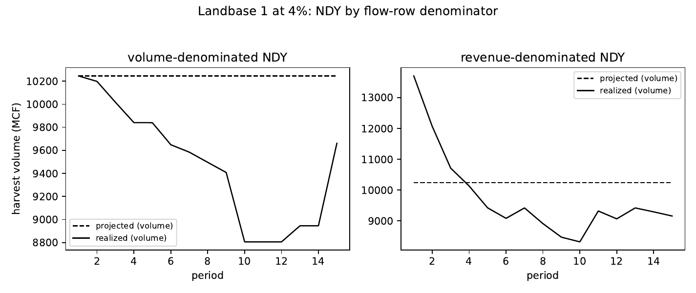

# 07 — E3: Value-denominated flow constraints

Does denominating the bounded-deviation flow constraint in undiscounted net
revenue (instead of volume) mitigate or eliminate inconsistency? Grid: 864
cells (18 landbases x 4 rates x 6 policies x 2 denominators), each with the
gap diagnostic and dual volume+revenue trajectory records. Records:
[summary](../results/experiments/grid_value_flow.csv) /
[trajectories](../results/experiments/grid_value_flow_trajectories.csv) /
[gaps](../results/experiments/grid_value_flow_gaps.csv).
Analysis writeup: [p11 writeup](../results/analysis/p11_value_flow/writeup.md).

## Headline

Revenue denominating makes inconsistency MORE pervasive: flow-constrained
occurrence 99% (revenue) vs
73% (volume), with roughly doubled magnitude. The
CM-CE filler channel is confirmed as the TELL, not the fuel: revenue NDY
drives projected CM-CE harvest to exactly zero (vs 2.5-3.5% of projected
volume under volume NDY on landbase 1), yet the plan is still not followed.
See the writeup's Table T4 for the focal solves.

## Occurrence and magnitude by denominator and policy (flow-constrained)

| flow_denominator | flow_policy | occurrence | mean_abs_rel_deviation |
| --- | --- | --- | --- |
| revenue | +/-10% | 1.0 | 0.146 |
| revenue | +/-20% | 1.0 | 0.162 |
| revenue | -10% | 0.986 | 0.161 |
| revenue | -20% | 0.986 | 0.186 |
| revenue | NDY | 1.0 | 0.133 |
| volume | +/-10% | 0.708 | 0.112 |
| volume | +/-20% | 0.792 | 0.13 |
| volume | -10% | 0.708 | 0.12 |
| volume | -20% | 0.583 | 0.128 |
| volume | NDY | 0.861 | 0.097 |
