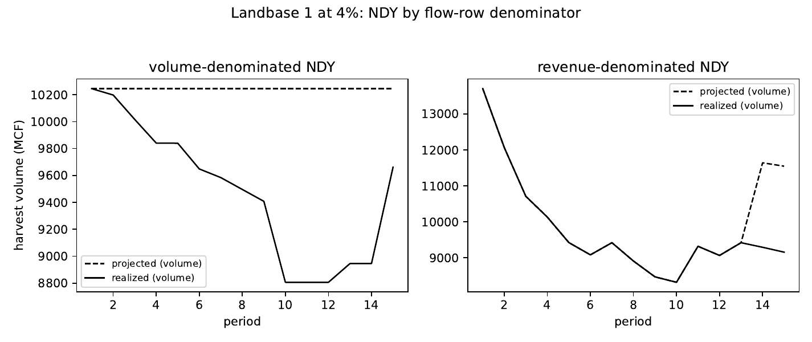

# 07 — E3: Value-denominated flow constraints

Does denominating the bounded-deviation flow constraint in undiscounted net
revenue (instead of volume) mitigate or eliminate inconsistency? Grid: 864
cells (18 landbases x 4 rates x 6 policies x 2 denominators), each with the
gap diagnostic and dual volume+revenue trajectory records. Records:
[summary](../results/experiments/grid_value_flow.csv) /
[trajectories](../results/experiments/grid_value_flow_trajectories.csv) /
[gaps](../results/experiments/grid_value_flow_gaps.csv).
Analysis writeup: [p11 writeup](../results/analysis/p11_value_flow/writeup.md).

> Correction (P14, issue #75): the E3 records were regenerated after a defect
> that announced the volume-denominated plan in revenue-denominated cells; the
> earlier conclusion (revenue denominating worsens inconsistency) is reversed.

## Headline

Revenue denominating MITIGATES inconsistency without eliminating it:
flow-constrained occurrence 200/360
(56%, revenue) vs
263/360 (73%,
volume); mean magnitude 0.108 vs
0.117. The effect differs by policy form
(table below): NDY and bounded decline fall sharply, symmetric bounded
deviation rises slightly. Revenue NDY drives projected CM-CE harvest to
exactly zero (vs 2.5-3.5% of projected volume under volume NDY on
landbase 1), and on the paired landbases (with vs without CM-CE) the extra
inconsistency associated with negatively valued strata disappears under
revenue denominating; inconsistency persists through the remaining strata.
See the writeup's Table T4 and paired-landbase table.

## Occurrence and magnitude by denominator and policy (flow-constrained)

| flow_denominator | flow_policy | occurrence | mean_abs_rel_deviation |
| --- | --- | --- | --- |
| revenue | +/-10% | 0.75 | 0.135 |
| revenue | +/-20% | 0.847 | 0.147 |
| revenue | -10% | 0.375 | 0.095 |
| revenue | -20% | 0.403 | 0.106 |
| revenue | NDY | 0.403 | 0.057 |
| volume | +/-10% | 0.708 | 0.112 |
| volume | +/-20% | 0.792 | 0.13 |
| volume | -10% | 0.708 | 0.12 |
| volume | -20% | 0.583 | 0.128 |
| volume | NDY | 0.861 | 0.097 |
