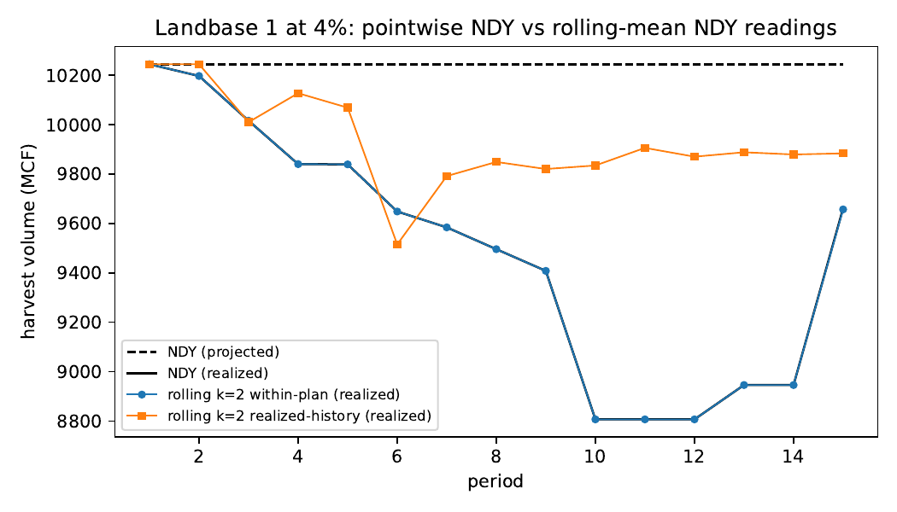

# 08 — E4: Rolling-mean NDY

Does flooring each period's harvest at the backwards-facing rolling 2- or
3-period mean (instead of the previous period's level) change inconsistency?
Grid: 288 cells (18 landbases x 4 rates x windows {2, 3} x both anchoring
readings). Records: [summary](../results/experiments/grid_rolling_mean.csv) /
[trajectories](../results/experiments/grid_rolling_mean_trajectories.csv) /
[gaps](../results/experiments/grid_rolling_mean_gaps.csv).
Analysis writeup: [p12 writeup](../results/analysis/p12_rolling_mean/writeup.md).

## Headline

Constraint SHAPE is not the operative margin: within-plan rolling-mean
occurrence 89% ≈ pointwise NDY (86%). The ANCHORING
INSTITUTION is: realized-history anchoring mitigates (occurrence
69%, magnitude 0.072)
but the floor cannot be sustained in 21% of replan
periods (mean relax_share) — the declining-NDY mechanism as recorded
infeasibility.

## By anchoring reading and window

| anchoring | flow_window | occurrence | mean_abs_rel_deviation | relax_share |
| --- | --- | --- | --- | --- |
| realized-history | 2 | 0.653 | 0.068 | 0.194 |
| realized-history | 3 | 0.722 | 0.075 | 0.228 |
| within-plan | 2 | 0.889 | 0.1 | 0.0 |
| within-plan | 3 | 0.889 | 0.102 | 0.0 |
